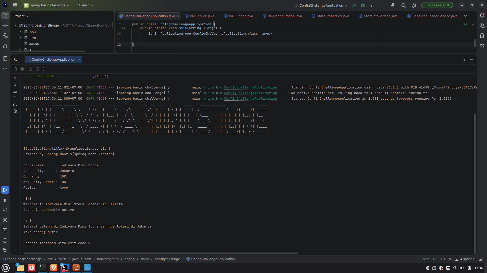
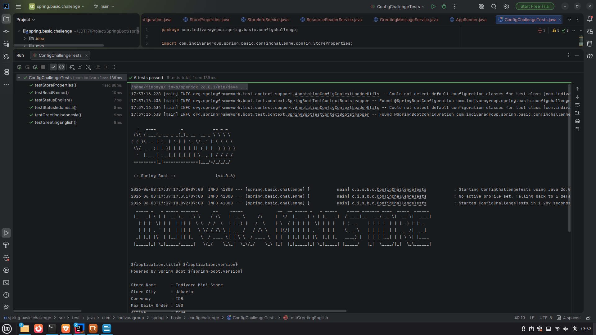

# Tugas Spring Boot + Test CAse

Nama: Finodya Yahdun

## Screenshot

### Output 1

### Output 2

### Apa fungsi @ConfigurationProperties?
Digunakan untuk melakukan binding konfigurasi dari file application.yml ke dalam Java Object sehingga konfigurasi dapat diakses dengan lebih terstruktur dan mudah dikelola.

### Apa fungsi ResourceLoader?
Digunakan untuk membaca resource seperti file yang berada di folder resources menggunakan classpath, filesystem, maupun URL.

### Apa fungsi MessageSource?
Digunakan untuk mengelola pesan aplikasi yang mendukung internationalization (i18n) sehingga pesan dapat ditampilkan dalam berbagai bahasa berdasarkan Locale yang digunakan.